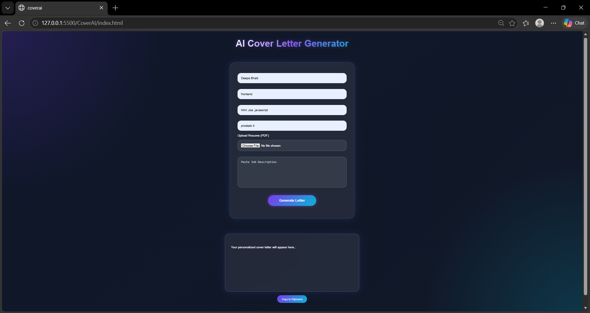

# 🚀 CoverAI – AI Cover Letter Generator

CoverAI is a smart web application that helps users generate professional cover letters instantly using AI-like logic. It also supports resume upload for personalized content.

---

## 🌟 Features

* ✨ Generate professional cover letters
* 📄 Upload resume (PDF) for personalization
* 🧠 Extract text from PDF using PDF.js
* 📋 Copy to clipboard
* 🎨 Modern UI with animations
* ⚡ Fast and responsive design

---

## 🛠️ Tech Stack

* HTML
* CSS
* JavaScript
* PDF.js (for PDF parsing)
* Vite (for environment setup)

---

## 📸 Screenshots

---

## 🔗 Live Demo 
## live demo 
👉 https://ai-cover-letter-gold.vercel.app/

---

## 🧠 How It Works

1. User enters details (Name, Role, Skills, Company)
2. Uploads resume (optional)
3. App extracts text from PDF
4. Generates a personalized cover letter
5. User can copy or download

---

## 🔐 Security Note

API keys are stored securely using `.env` and are not exposed in the code.

---

## 💡 Future Improvements

* Real AI integration (Gemini/OpenAI)
* Download as PDF
* Multiple templates
* Tone selection (formal, creative, etc.)

---

## 👩‍💻 Author

Deepa Bhatt
Frontend Developer

---
